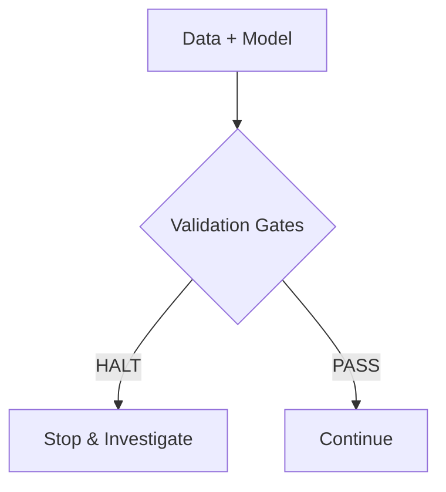
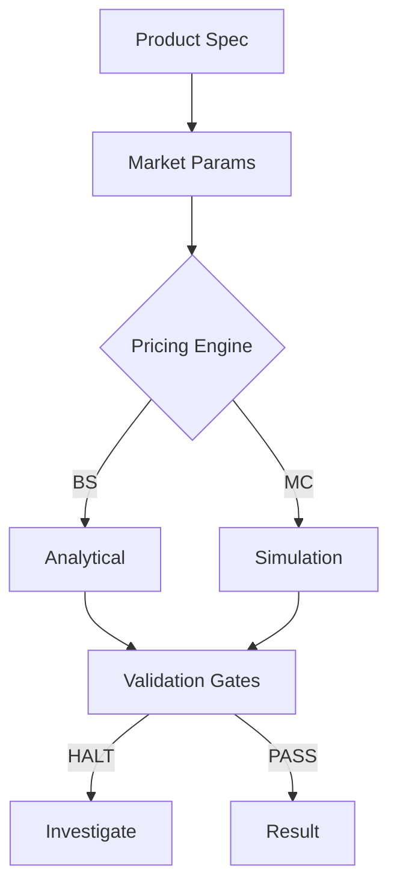

# Feature Gap Analysis: temporalcv → annuity-pricing

**Date**: 2026-01-09
**Source**: [temporalcv](https://github.com/brandon-behring/temporalcv) analysis
**Purpose**: Identify features/qualities temporalcv has that annuity-pricing could adopt

---

## Executive Summary

temporalcv demonstrates **production-grade engineering** with features annuity-pricing could benefit from. The key gaps fall into **6 categories**: documentation presentation, **pedagogical architecture**, validation architecture, developer experience, statistical rigor, and branding.

**Key findings**:
- temporalcv has 15 notebooks in a tiered curriculum (Tier 0→3 progressive learning)
- Notebook validation runs in CI via `jupyter nbconvert --execute`
- 5 failure-driven learning examples with WHAT/WHY/FIX/VALIDATION pattern
- Knowledge tier system: [T1] Academic, [T2] Empirical, [T3] Practitioner
- Sphinx Gallery integration auto-generates docs from examples

**Additional patterns from causal_inference_mastery**:
- `scripts/update_metrics.py` → `docs/METRICS_CURRENT.md` automation
- Cross-language validation (Python ↔ Julia) — applicable as QuantLib validation

---

## Feature Comparison Matrix

| Feature | temporalcv | annuity-pricing | Gap Severity |
|---------|:----------:|:---------------:|:------------:|
| **Documentation** | | | |
| SVG Logo | ✓ | ✗ | Medium |
| Feature comparison table (vs competitors) | ✓ | ✗ | High |
| Mermaid diagrams | ✓ | ✗ | Medium |
| Validation evidence table | ✓ | Partial | Medium |
| Failure case studies | ✓ (5 examples) | ✗ | High |
| Colab/Binder badge | ✓ | ✗ | Low |
| **Pedagogical Architecture** | | | |
| Tiered curriculum (Tier 0-3) | ✓ (15 notebooks) | ✗ | High |
| Notebook validation in CI | ✓ (`nbval`) | ✗ | Medium |
| Failure-driven learning examples | ✓ (WHAT/WHY/FIX) | ✗ | High |
| Knowledge tier system [T1]/[T2]/[T3] | ✓ | ✗ | Medium |
| Sphinx Gallery integration | ✓ | ✗ | Medium |
| Metrics automation script | ✓* | ✗ | Low |
| **Testing Architecture** | | | |
| 6-layer validation (documented) | ✓ | Partial | High |
| SPECIFICATION.md (frozen params) | ✓ | METHODOLOGY.md | Low |
| Golden reference tests (R/external) | ✓ | Hull examples | Medium |
| Monte Carlo nightly CI | ✓ | ✗ | Medium |
| Property-based tests (Hypothesis) | ✓ | ✓ | None |
| Anti-pattern pedagogical docs | ✓ | Minimal | High |
| **Developer Experience** | | | |
| Model cards | ✓ | ✗ | Medium |
| CHANGELOG (detailed + tiers) | ✓ | Basic | Low |
| Quick Start (3 lines) | ✓ | 10+ lines | Medium |
| **Statistical Rigor** | | | |
| Validation evidence table | ✓ | Scattered | Medium |
| Type I error calibration | ✓ | ✗ | Low |
| Benchmark results (M4/M5) | ✓ | N/A | N/A |

*From causal_inference_mastery repo

---

## Priority 1: High-Impact Gaps

### 1.1 Feature Comparison Table

**temporalcv has**:
```markdown
| Feature | temporalcv | sklearn | sktime | darts |
|---------|:----------:|:-------:|:------:|:-----:|
| Gap enforcement | ✓ | ✗ | ✗ | ✗ |
| Leakage detection gates | ✓ | ✗ | ✗ | ✗ |
```

**annuity-pricing needs**:
```markdown
| Feature | annuity-pricing | QuantLib | financepy | lifelib |
|---------|:---------------:|:--------:|:---------:|:-------:|
| **Products** | | | | |
| RILA buffer/floor pricing | ✓ | ✗ | ✗ | ✗ |
| FIA crediting methods | ✓ | ✗ | Partial | ✗ |
| GLWB valuation | ✓ | ✗ | ✗ | Partial |
| MYGA present value | ✓ | ✓ | ✓ | ✓ |
| **Pricing Engines** | | | | |
| Black-Scholes | ✓ | ✓ | ✓ | ✗ |
| Heston stochastic vol | ✓ | ✓ | ✓ | ✗ |
| Monte Carlo (GBM) | ✓ | ✓ | ✓ | ✓ |
| **Validation** | | | | |
| Anti-pattern tests (HALT) | ✓ | ✗ | ✗ | ✗ |
| Cross-library validation | ✓ | N/A | N/A | ✗ |
| Put-call parity checks | ✓ | ✗ | ✗ | ✗ |
| **Regulatory** | | | | |
| VM-21/VM-22 prototypes | ✓ | ✗ | ✗ | ✗ |
| **Ease of Use** | | | | |
| Python-native | ✓ | SWIG | ✓ | ✓ |
| Type hints | ✓ | ✗ | Partial | ✓ |
```

### 1.2 Failure Case Studies (Pedagogical)

**temporalcv has**:
- `16_failure_rolling_stats.py` — How rolling stats leak future
- `17_failure_threshold_leak.py` — Regime boundary leakage
- `19_failure_missing_gap.py` — No gap = direct lookahead
- `20_failure_kfold.py` — 47.8% fake improvement from KFold

**annuity-pricing needs** (tiered by severity):

**Critical (visible in README)**:
- `failure_01_no_risk_neutral.py` — Using real-world drift μ instead of risk-free r
- `failure_02_put_call_parity.py` — What happens when BS implementation is wrong
- `failure_03_arbitrage_bounds.py` — Option price > underlying value

**Important (linked gallery)**:
- `failure_04_buffer_floor_confusion.py` — Mixing up buffer vs floor protection
- `failure_05_mc_divergence.py` — MC price diverges from analytical BS
- `failure_06_negative_vol.py` — Edge cases that break pricing
- `failure_07_no_floor_enforcement.py` — FIA payoff going negative

### 1.3 6-Layer Validation Architecture (Documented)

**temporalcv has** `docs/testing_strategy.md`:
```
Layer 1: Unit tests (pure functions)
Layer 2: Integration tests (CV + metrics)
Layer 3: Anti-pattern tests (leakage detection)
Layer 4: Property tests (statistical invariants)
Layer 5: Benchmark tests (M4/M5 datasets)
Layer 6: End-to-end validation
```

**annuity-pricing has** similar layers but could formalize as:
- Layer 1: Unit tests
- Layer 2: Integration tests
- Layer 3: Anti-pattern tests (HALT protocol)
- Layer 4: Property tests
- Layer 5: Known-answer tests (Hull)
- Layer 6: Cross-library validation

### 1.4 Anti-Pattern Pedagogical Documentation

**temporalcv has** detailed explanations in README:
```markdown
| Pattern | Example | Why It's Bad |
|---------|---------|--------------|
| Rolling stats on full series | `.rolling().mean()` without `.shift()` | Features encode future |
```

**annuity-pricing needs** similar table:
```markdown
| Anti-Pattern | Example | Why It's Bad |
|--------------|---------|--------------|
| Real-world drift | μ instead of r in GBM | Option mispriced |
| Option > underlying | Call > S₀ | Arbitrage violation |
| FIA payoff < 0% | No floor enforcement | Contract violation |
| Put-call parity violated | |C - P| > tolerance | BS implementation error |
```

---

## Priority 2: Medium-Impact Gaps

### 2.1 SVG Logo

**temporalcv has**: `docs/images/logo.svg` with styled text
**annuity-pricing needs**: Mathematical symbol (∫ or Σ) + text SVG

### 2.2 Mermaid Diagrams

**temporalcv has** validation pipeline:


**annuity-pricing needs** pricing workflow:


### 2.3 Validation Evidence Table

**temporalcv has** in README:
```markdown
| Test | Reference | Result |
|------|-----------|--------|
| DM test golden values | R `forecast::dm.test()` | ✓ Match |
| Type I error rate | 500 Monte Carlo sims | 5% ± 2% |
```

**annuity-pricing needs**:
```markdown
| Test | Reference | Result |
|------|-----------|--------|
| Put-call parity | Hull (2021) | ✓ < 1e-10 |
| BS call price | Hull Example 15.6 | ✓ Match |
| MC convergence | 100k paths | < 1% error |
| Cross-validation | financepy | ✓ Match |
```

### 2.4 Golden Reference Tests (Formalized)

**temporalcv has**:
- `tests/golden_reference/dm_test_golden.json`
- `tests/known_answer/test_dm_paper_values.py`

**annuity-pricing has**:
- Hull examples in fixtures (good)
- Could formalize as `tests/golden_reference/` directory

### 2.5 Model Cards

**temporalcv has** `docs/model_cards/` for key classes
**annuity-pricing needs** model cards for:
- `FIAPricer` — capabilities, assumptions, limitations
- `RILAPricer` — buffer/floor mechanics
- `GLWBPricer` — PDE vs MC approaches

### 2.6 Quick Start (Minimal)

**temporalcv has** (3 lines):
```python
from temporalcv import run_gates
report = run_gates(model, X, y)
print(report.status)  # HALT, WARN, or PASS
```

**annuity-pricing has** (10+ lines):
```python
from annuity_pricing import FIAPricer, FIAProduct, MarketParams
market = MarketParams(spot=100, ...)
pricer = FIAPricer(market_params=market)
product = FIAProduct(...)
result = pricer.price(product)
```

**Could simplify to**:
```python
from annuity_pricing import price_fia_quick
result = price_fia_quick(cap=0.10, term=7)
print(result.fair_cap)
```

---

## Priority 2.5: Pedagogical & Notebook Architecture

### 2.7 Tiered Curriculum Structure

**temporalcv has** (15 notebooks, progressive difficulty):
```
Tier 0: Onboarding Bridge
└── 00_time_series_fundamentals.ipynb — For sklearn practitioners

Tier 1: Core Concepts (Why)
├── 01_why_temporal_cv.ipynb — Four traps structure
├── 02_leakage_detection.ipynb — Visual "before/after"
└── 03_gap_enforcement.ipynb — h-step intuition

Tier 2: Deep Dives (How)
├── 05_shuffled_target_gate.ipynb — Gate mechanics
├── 06_mase_vs_mae.ipynb — High-persistence metrics
└── 08_conformal_intervals.ipynb — Uncertainty quantification

Tier 3: Integration (Apply)
├── 10_end_to_end_validation.ipynb — Full pipeline
└── 12_regime_stratified_evaluation.ipynb — Capstone
```

**annuity-pricing could adopt**:
```
Tier 0: Onboarding
└── 00_pricing_foundations.ipynb — For quant practitioners

Tier 1: Core Concepts
├── 01_risk_neutral_valuation.ipynb — Why μ → r
├── 02_put_call_parity.ipynb — Validation first principles
└── 03_arbitrage_bounds.ipynb — Price constraints

Tier 2: Product Deep Dives
├── 05_fia_crediting_methods.ipynb — S2S, PTP, Annual Reset
├── 06_rila_buffer_vs_floor.ipynb — Protection mechanics
└── 08_monte_carlo_convergence.ipynb — Path counts, seeds

Tier 3: Integration
├── 10_end_to_end_pricing.ipynb — Full workflow
└── 12_cross_library_validation.ipynb — vs financepy
```

### 2.8 Notebook Validation in CI

**temporalcv has** (`.github/workflows/notebooks.yml`):
```yaml
- name: Execute notebooks
  run: |
    for nb in notebooks/*.ipynb; do
      jupyter nbconvert --to notebook --execute "$nb" \
        --ExecutePreprocessor.timeout=300
    done
```

**Key patterns**:
- 300s timeout per notebook
- Fails CI if any notebook errors
- `nbval` pytest plugin for output validation
- `ipykernel` as dev dependency

**annuity-pricing needs**:
- Add `notebooks.yml` workflow
- Add `nbval>=0.11.0` and `ipykernel>=6.0` to dev deps
- Create `notebooks/` directory with executable demos

### 2.9 Failure-Driven Learning (Pedagogy)

**temporalcv pattern** (examples 16-20):
```python
"""
Example 16: Rolling Stats Leak
=============================

WHAT GOES WRONG: Using .rolling().mean() on full series
                 before train/test split

WHY IT'S WRONG: Rolling window "sees" future values

THE FIX: Apply .shift(1) BEFORE rolling, or compute
         rolling stats only on training data

VALIDATION: Run with validation gates to detect
"""
# Code that BREAKS
df['feature'] = df['target'].rolling(20).mean()  # ❌ Leaks!

# Code that WORKS
df['feature'] = df['target'].shift(1).rolling(20).mean()  # ✓ Safe
```

**Pattern elements**:
1. Clear section headers (WHAT/WHY/FIX/VALIDATION)
2. Side-by-side broken vs working code
3. ❌/✓ visual markers
4. Quantified impact ("47.8% fake improvement")

### 2.10 Knowledge Tier System

**temporalcv model cards use**:
```markdown
**Knowledge Tier**: [T1] Academic

| Tier | Source | Example |
|------|--------|---------|
| [T1] | Peer-reviewed papers | Diebold-Mariano (1995) |
| [T2] | Empirical studies | M4 Competition results |
| [T3] | Practitioner heuristics | "Use 5-fold for <1000 samples" |
```

**annuity-pricing equivalents**:
```markdown
| Tier | Source | Example |
|------|--------|---------|
| [T1] | Academic | Hull (2021), Black-Scholes (1973) |
| [T2] | Industry | SOA mortality tables, VM-21 |
| [T3] | Practitioner | "100k paths usually sufficient" |
```

### 2.11 Metrics Automation

**Pattern discovered** (from causal_inference_mastery):
```
scripts/update_metrics.py → docs/METRICS_CURRENT.md
```

**Auto-generates**:
- Test count by category
- Coverage percentages
- Lines of code
- Property test statistics

**annuity-pricing could adopt**:
```python
# scripts/update_metrics.py
metrics = {
    "total_tests": count_tests("tests/"),
    "anti_pattern_tests": count_tests("tests/anti_patterns/"),
    "hull_validations": count_fixtures("hull"),
    "coverage": get_coverage_percent(),
}
write_markdown("docs/METRICS_CURRENT.md", metrics)
```

### 2.12 Sphinx Gallery Integration

**temporalcv uses**:
- `sphinx-gallery>=0.15.0` in docs deps
- Python scripts → auto-rendered gallery pages
- Thumbnails auto-generated from plots
- Examples executable as notebooks

**Benefits for annuity-pricing**:
- Examples become documentation
- CI validates examples work
- Users can download as notebooks

---

## Priority 3: Nice-to-Have Gaps

### 3.1 Colab/Binder Badge
- Interactive notebook demo

### 3.2 Monte Carlo Nightly CI
- Extended validation jobs (too slow for every commit)

### 3.3 CHANGELOG with Feature Tiers
- `[T1]` tags on new features

### 3.4 Downloads Badge
- PyPI download stats

### 3.5 Cross-Language Validation
- Python ↔ Julia result matching (from causal_inference_mastery)
- For annuity-pricing: could validate against QuantLib C++ via Python bindings

---

## Implementation Phases

### Phase 1: Documentation (2-3 hours)
1. Enhance `docs/testing_strategy.md` with 6-layer architecture
2. Add anti-pattern explanation table to README
3. Add validation evidence table to README
4. Add feature comparison table (vs QuantLib + financepy + lifelib)
5. Add Mermaid pricing workflow diagram

### Phase 2: Branding (1-2 hours)
1. Create mathematical symbol SVG logo (∫ or Σ + "annuity-pricing")
2. Add logo to README header
3. Add Colab badge (if demo notebook exists)

### Phase 3: Failure Examples (3-4 hours)
1. Create `examples/failures/` directory
2. Create 7+ tiered failure examples
3. Add failure patterns table to README linking to gallery
4. Follow WHAT/WHY/FIX/VALIDATION docstring pattern
5. Include ❌/✓ visual markers for broken vs working code

### Phase 4: API Enhancements (2-3 hours)
1. Add `.demo()` class methods to key classes
2. Update quick start in README to use `.demo()`
3. Create model cards for key pricers

### Phase 5: Pedagogical Infrastructure (2-3 hours)
1. Create `notebooks/` directory with tiered curriculum
2. Add `.github/workflows/notebooks.yml`
3. Add to dev dependencies: `nbval>=0.11.0`, `ipykernel>=6.0`
4. Create model card template with knowledge tier system

### Phase 6: Metrics Automation (1 hour)
1. Create `scripts/update_metrics.py`
2. Auto-generate `docs/METRICS_CURRENT.md`
3. Add pre-commit hook or CI job to update metrics

---

## Files to Create/Modify

| File | Action | Priority |
|------|--------|----------|
| `docs/testing_strategy.md` | Enhance with 6-layer docs | P1 |
| `README.md` | Add tables, diagrams, logo | P1 |
| `docs/images/logo.svg` | Create (∫ + text) | P1 |
| `examples/failures/` | Create directory + 7 files | P1 |
| `notebooks/` | Create tiered curriculum | P1 |
| `.github/workflows/notebooks.yml` | Create | P1 |
| `pyproject.toml` | Add nbval, ipykernel to dev deps | P1 |
| `src/annuity_pricing/data/schemas.py` | Add .demo() methods | P2 |
| `docs/model_cards/TEMPLATE.md` | Create | P2 |
| `scripts/update_metrics.py` | Create | P3 |
| `docs/METRICS_CURRENT.md` | Auto-generated | P3 |

---

## Research Sources

- [pyOpenSci README Best Practices](https://www.pyopensci.org/python-package-guide/documentation/repository-files/readme-file-best-practices.html)
- [Real Python: README Files](https://realpython.com/readme-python-project/)
- [CodeRefinery: Writing README Files](https://coderefinery.github.io/documentation/writing-readme-files/)
- [QuantLib-Python Documentation](https://quantlib-python-docs.readthedocs.io/)
- [lifelib: Actuarial Models in Python](https://lifelib.io/)

---

## Conclusion

**Top 8 adoptable features** (highest impact, reasonable effort):

### Tier A: Foundational (immediate professional impact)
1. **Feature comparison table** — Immediately shows value vs alternatives
2. **6-layer testing strategy doc** — Formalizes existing good practices
3. **Failure-driven learning examples** — Teaches what NOT to do with WHAT/WHY/FIX pattern
4. **SVG logo + Mermaid diagrams** — Professional visual identity

### Tier B: Pedagogical Architecture (differentiating)
5. **Tiered notebook curriculum** — Tier 0→3 progressive learning path
6. **Notebook validation in CI** — Guarantees examples always work
7. **Knowledge tier system** — [T1] Academic → [T2] Industry → [T3] Practitioner

### Tier C: Developer Experience
8. **`.demo()` preset methods** — 3-line quick start instead of 10+ lines

---

**Key insight**: temporalcv's pedagogical architecture (15 notebooks, 21 examples, failure-driven learning) is what transforms it from "library with docs" to "learning system with library." This pattern could significantly elevate annuity-pricing's adoption and perceived professionalism.

**Estimated total effort**: 12-16 hours across 6 phases
